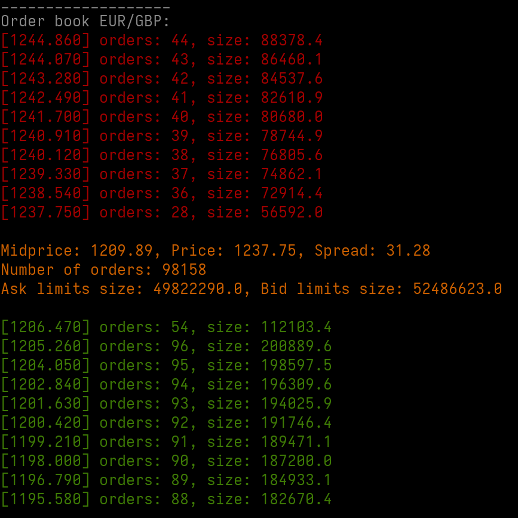

# Exchange
Market exchange simulation.

It is made from scratch, it does not not rely any third-party dependency except Go's stdlib. \
The matching engine implements the Price/Time (First In First Out) algorithm. 

For now, it is only possible to place the two "basic" types of orders (market and limit).\
Canceling orders is not fully implemented yet, at least not efficiently.\
This project should be rewritten in a much cleaner way and with better error handling when I'll have some time.
